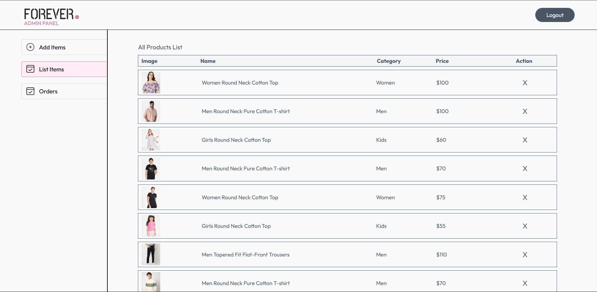

# 🛒 E-Commerce Platform (MERN Stack)

A full-featured, modern e-commerce platform built with the **MERN stack** (MongoDB, Express.js, React.js, Node.js) with secure authentication, powerful admin controls, and a beautiful shopping experience.

---

## 🚀 Features

### 🔐 User Authentication

- Secure login & registration
- JWT-based token authentication
- Protected routes with role-based access

### 🛍️ Product Management

- Add/update/delete products (admin only)
- Cloudinary image uploads
- Category filtering, search functionality

### 🛒 Shopping Experience

- Add/remove items from cart
- Checkout process and order placement
- Order tracking in user dashboard

### 🧑‍💼 Admin Dashboard

- Manage users, products & orders
- View platform analytics (orders, revenue, etc.)

---

## 📸 Demo UI Preview

| Home Page                                       | Product Page                                                  | Admin Dashboard                                             |
| ----------------------------------------------- | ------------------------------------------------------------- | ----------------------------------------------------------- |
|  |  |  |

---

## 🖼️ Screenshots

### 🏠 Home Page


### 🛍️ Product Details


### 🛒 Cart Page


### 🧑‍💼 Admin Dashboard


---

## 🧰 Tech Stack

### 🖥️ Frontend

- React.js + Tailwind CSS
- Vite + React Router DOM
- Axios + React Toastify

### 🖥️ Backend

- Node.js + Express.js
- MongoDB + Mongoose
- JWT + Bcrypt
- Multer + Cloudinary

---

## ⚙️ Installation Guide

### ✅ Prerequisites

- Node.js (v14 or later)
- MongoDB
- npm or yarn

### 🔧 Setup Instructions

1. **Clone the Repository**
   ```bash
   git clone <repository-url>
   cd Ecommerce-main
   ```
